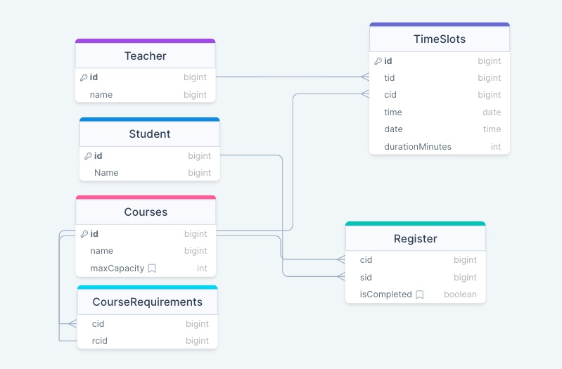

# Semester Course Registration API

Semester Course Registration API is made using Node.js, showcasing expertise in RESTful API design, data modeling. This API enables students to register for courses in a given semester, track their course schedules.

## Tech Stack Used

- Express
- MySQL
- Drizzle ORM
- Zod
- TypeScript
- NodeJS

## Features

1. **Course Limit for Students**:

   - Students can register for a maximum of 5 courses per semester.

2. **Scheduling Constraints**:

   - Each course has a fixed slot and a designated teacher.
   - No teacher can teach two courses during the same slot.
   - Similarly, no student can register for two courses that occur at the same slot.

3. **Course Prerequisites**:
   - Students are required to complete prerequisite courses before registering for advanced courses.
   - The API checks for these prerequisites before allowing registration.

## Entity Realtion Diagram



created using [drawsql.com](https://drawsql.app/)

### Installation

Using pnpm

```sh
pnpm install
```

Using npm

```sh
npm install
```

### Setup

Example `.env` file

```.env
PORT=3000
DB_URI=mysql://localhost
```

### Running

using pnpm

```sh
pnpm start
```

using npm

```sh
npm run start
```
